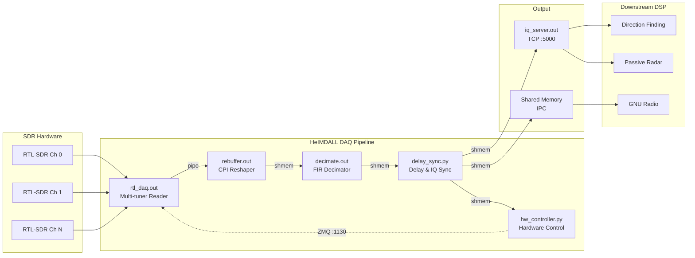
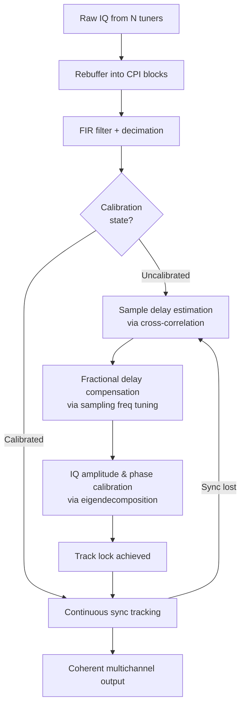
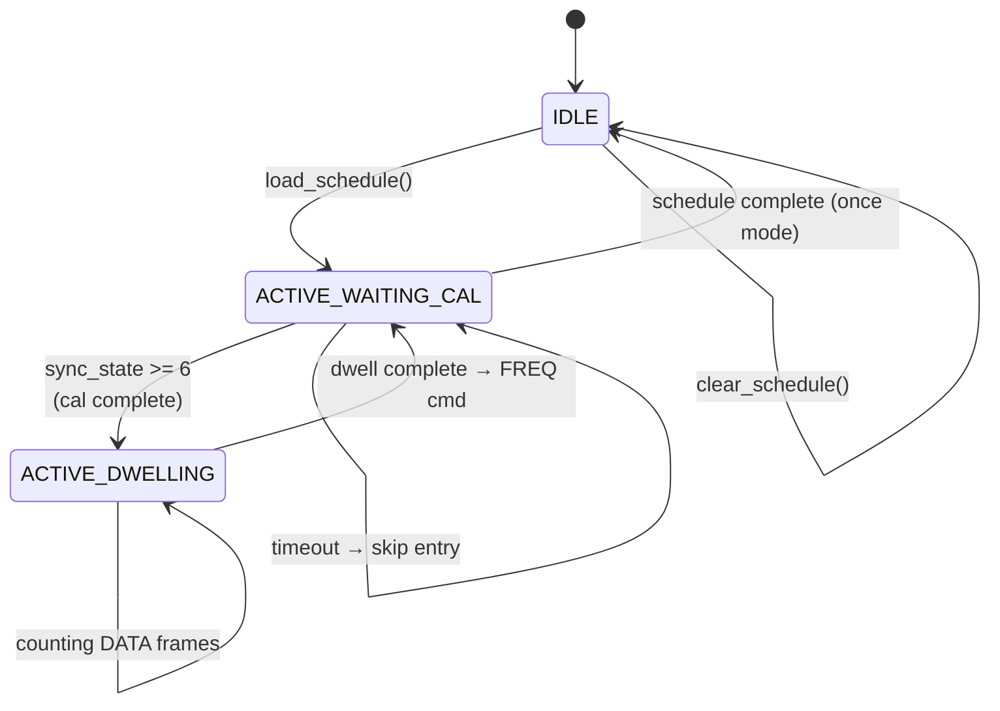
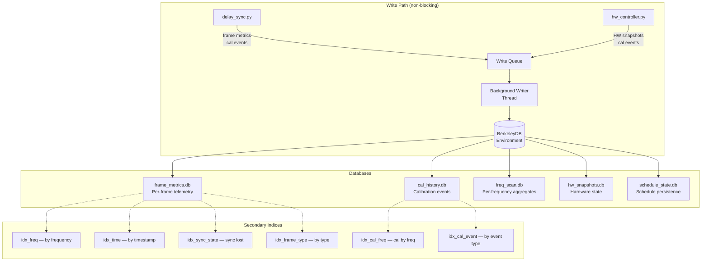
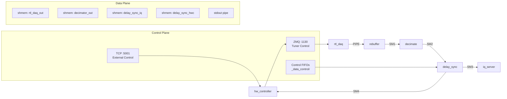

# HeIMDALL DAQ Firmware

Coherent data acquisition and signal processing chain for KrakenSDR multichannel RTL-SDR receivers. Designed for Raspberry Pi 4 (ARM64) and x86_64 Linux systems.

HeIMDALL captures raw IQ samples from multiple synchronized RTL-SDR tuners, performs sample-level and IQ-level calibration across all channels, and delivers coherent multichannel data to downstream DSP applications such as direction finding, passive radar, and GNU Radio.

## Architecture Overview



## Core Capabilities

### Real-Time Coherent Data Acquisition

The pipeline transforms raw ADC samples from multiple unsynchronized RTL-SDR tuners into a coherent multichannel IQ stream:



- **Sample-level synchronization** -- Cross-correlation-based delay estimation and compensation across all channels
- **Fractional sample delay correction** -- Phase-frequency curve fitting with sampling frequency PPM tuning
- **IQ calibration** -- Amplitude and phase correction via spatial correlation matrix eigendecomposition
- **Continuous tracking** -- Real-time monitoring of sync quality with automatic recalibration on drift or frequency change
- **Noise source calibration** -- Internal noise source switching for controlled calibration bursts (continuous or burst mode)

### Hardware Control

The hardware controller manages the RF front-end and calibration hardware:

- **Gain control** -- Per-channel or unified IF gain management with overdrive protection and automatic tuning
- **Frequency tuning** -- RF center frequency changes via ZMQ to the receiver module
- **Noise source control** -- Programmable internal noise source for calibration (with automatic gain preset during cal)
- **AGC support** -- Optional automatic gain control mode
- **External control interface** -- TCP server on port 5001 accepting FREQ, GAIN, AGC, and INIT commands

### Dynamic Signal Scheduling

Automated frequency hopping and scanning with calibration-aware timing:



- **Schedule definitions** -- INI config (inline frequencies/gains/dwell) or JSON files
- **Repeat modes** -- Loop (continuous), once (single pass), pingpong (forward-reverse)
- **Calibration-aware** -- Waits for sync lock before counting dwell frames; defers transitions during calibration bursts
- **Runtime control** -- Load (SCHD), stop (SCHS), query (SCHQ), and skip-next (SCHN) commands via TCP
- **Per-entry gains** -- Optional per-frequency gain presets applied automatically on hop

### Persistent Signal Analysis (BerkeleyDB)

Optional persistent storage for operational metrics and calibration history:



- **Non-blocking writes** -- All writes queued to a daemon background thread; zero impact on real-time pipeline
- **Frame metrics** -- Per-frame: frequency, sync state, gains, channel powers, SNR, cal quality
- **Calibration history** -- State transition events with IQ corrections, delays, and sync counters
- **Frequency scan aggregates** -- Running averages of SNR and cal quality per visited frequency
- **Hardware snapshots** -- Periodic capture of gain values, overdrive flags, noise source state
- **Automatic rotation** -- Configurable max age (default 7 days) with hourly cleanup and compaction
- **Rich query API** -- Time range, frequency, sync state, and event type queries via secondary indices

### Inter-Process Communication



- **Shared memory ring buffers** -- Double-buffered IQ data transfer between pipeline stages
- **ZMQ REQ/REP** -- 128-byte message protocol for frequency, gain, noise source, and sampling frequency control
- **TCP control** -- 128-byte command frames (4-byte command + 124-byte payload) for external integration
- **1024-byte IQ headers** -- Binary frame headers with sync word, metadata, calibration state, and per-channel gains

## Configuration

All configuration is in `Firmware/daq_chain_config.ini`:

| Section | Key Parameters |
|---------|----------------|
| `[hw]` | `num_ch` (channels), `en_bias_tee` |
| `[daq]` | `center_freq`, `sample_rate`, `gain`, `en_noise_source_ctr` |
| `[pre_processing]` | `cpi_size`, `decimation_ratio`, `fir_tap_size`, `fir_window` |
| `[calibration]` | `cal_track_mode` (0/1/2), `corr_size`, `en_iq_cal`, tolerances |
| `[schedule]` | `en_schedule`, `frequencies`, `dwell_frames`, `repeat_mode` |
| `[database]` | `en_db`, `db_dir`, `rotation_max_age_hours`, `write_batch_size` |
| `[data_interface]` | `out_data_iface_type` (shmem/eth) |

Both `[schedule]` and `[database]` are **disabled by default** (`en_schedule=0`, `en_db=0`) for full backward compatibility.

Use `util/cfg_gen.py` for automatic configuration generation from signal parameters:
```bash
python3 util/cfg_gen.py --bri 100 --burst_length 10 --bw 100
```

## Usage

### Quick Start

```bash
# Start with real SDR hardware
cd Firmware
sudo ./daq_start_sm.sh

# Or start in simulation mode (no hardware required)
sudo ./daq_synthetic_start.sh

# Stop the DAQ chain
sudo ./daq_stop.sh
```

### Frequency Scanning Example

Set in `daq_chain_config.ini`:
```ini
[schedule]
en_schedule = 1
schedule_mode = inline
frequencies = 433000000, 868000000, 915000000
dwell_frames = 200, 200, 200
repeat_mode = loop
require_cal_on_hop = 1
```

Or load at runtime via TCP:
```python
import socket, json
s = socket.socket(socket.AF_INET, socket.SOCK_STREAM)
s.connect(("localhost", 5001))
payload = json.dumps({"name": "scan", "repeat_mode": "loop", "entries": [
    {"frequency": 433000000, "dwell_frames": 200},
    {"frequency": 868000000, "dwell_frames": 200}
]})
msg = b"SCHD" + payload.encode().ljust(124, b'\x00')
s.send(msg)
```

### Database Queries

```python
from _daq_core.daq_db import DAQDatabase
db = DAQDatabase(db_dir='_db')
# Recent frames
frames = db.get_frame_metrics_by_time_range(start_ts_ms, end_ts_ms)
# Calibration events at a frequency
cal = db.get_cal_history(rf_center_freq=433000000)
# Per-frequency summary
for freq in db.get_freq_scan_summary():
    print(f"{freq.rf_center_freq/1e6:.1f} MHz: {freq.total_frames} frames, SNR {freq.avg_snr:.1f}")
db.close()
```

## Testing

```bash
cd Firmware
# Signal scheduler tests
python3 -m unittest -v _testing/unit_test/test_signal_scheduler.py

# Database record + integration tests
python3 -m unittest -v _testing/unit_test/test_daq_db.py

# Existing pipeline tests (require unit_test_k4 config)
sudo python3 -W ignore -m unittest -v _testing/unit_test/test_decimator.py
sudo python3 -W ignore -m unittest -v _testing/unit_test/test_delay_sync.py
```

## Build

```bash
cd Firmware/_daq_core
make          # builds rtl_daq.out, rebuffer.out, decimate.out, iq_server.out
make clean
```

Architecture auto-detected: x86_64 links KFR (`libkfr_capi`), ARM links Ne10 (`libNE10.a`) with NEON intrinsics. External libraries must be in `_daq_core/` before building.

Python modules require Python 3.8+ with: numpy, scipy, numba, configparser, pyzmq, scikit-rf. Optional: `berkeleydb` (for persistent storage).

## Manual Installation

Manual install is only required if you are not using the premade images, and are setting up the software from a clean system. If you just want to run the DoA or PR software using a premade image please take a look at our Wiki https://github.com/krakenrf/krakensdr_docs/wiki, specifically the "Direction Finding Quickstart Guide", and the "VirtualBox, Docker Images and Install Scripts" sections.

### Install script

If a premade image does not exist for your computing device, you can use one of our install scripts to automate a fresh install. The script will install heimdall, and the DoA and PR DSP software automatically. Details on the Wiki at https://github.com/krakenrf/krakensdr_docs/wiki/10.-VirtualBox,-Docker-Images-and-Install-Scripts#install-scripts

### Manual Step by Step Install

We recommend using the install script if you are installing to a fresh system instead of doing this step by step install. However, if you are having problems doing the step by step install may help you figure out what is going wrong.

This code should run on any Linux system running on a aarch64(ARM64) or x86_64 systems.

It been tested on [RaspiOS Lite 64-bit](https://downloads.raspberrypi.org/raspios_lite_arm64/images), Ubuntu 64-bit and Armbian 64-bit.

Note that due to the use of conda, the install will only work on 64-bit systems. If you do not wish to use conda, it is possible to install to 32-bit systems. However, the reason conda is used is because the Python repo's don't appear to support numba on several ARM devices without conda.

Steps prefixed with [ARM] should only be run on ARM systems. Steps prefixed with [x86_64] should only be run on x86_64 systems.

1. Install build dependencies
```
sudo apt update
sudo apt install build-essential git cmake libusb-1.0-0-dev lsof libzmq3-dev
```

If you are using a KerberosSDR on a Raspberry Pi 4 with the third party switches by Corey Koval, or an equivalent switch board:

```
sudo apt install pigpio
```

2. Install custom KrakenRF RTL-SDR kernel driver
```
cd
git clone https://github.com/krakenrf/librtlsdr
cd librtlsdr
sudo cp rtl-sdr.rules /etc/udev/rules.d/rtl-sdr.rules
mkdir build
cd build
cmake ../ -DINSTALL_UDEV_RULES=ON
make
sudo ln -s ~/librtlsdr/build/src/rtl_test /usr/local/bin/kraken_test

echo 'blacklist dvb_usb_rtl28xxu' | sudo tee --append /etc/modprobe.d/blacklist-dvb_usb_rtl28xxu.conf
```

Restart the system
```
sudo reboot
```

3. [ARM]  Install the Ne10 DSP library for ARM devices

For ARM 64-bit (e.g. Running 64-Bit Raspbian OS on Pi 4) *More info on building Ne10: https://github.com/projectNe10/Ne10/blob/master/doc/building.md#building-ne10*

```
cd
git clone https://github.com/krakenrf/Ne10
cd Ne10
mkdir build
cd build
cmake -DNE10_LINUX_TARGET_ARCH=aarch64 -DGNULINUX_PLATFORM=ON -DCMAKE_C_FLAGS="-mcpu=native -Ofast -funsafe-math-optimizations" ..
make
 ```

3. [X86_64] Install the KFR DSP library
```bash
sudo apt-get install clang
```
Build and install the library
```bash
cd
git clone https://github.com/krakenrf/kfr
cd kfr
mkdir build
cd build
cmake -DENABLE_CAPI_BUILD=ON -DCMAKE_CXX_COMPILER=clang++ -DCMAKE_BUILD_TYPE=Release ..
make
```

Copy the built library over to the system library folder:

```
sudo cp ~/kfr/build/lib/* /usr/local/lib
```

Copy the include file over to the system includes folder:

```
sudo mkdir /usr/include/kfr
sudo cp ~/kfr/include/kfr/capi.h /usr/include/kfr
```

Run ldconfig to reset library cache:

```
sudo ldconfig
```

4. Install Miniforge

Install via the appropriate script for the system you are using (ARM aarch64 / x86_64)

[ARM]
```
cd
wget https://github.com/conda-forge/miniforge/releases/latest/download/Miniforge3-Linux-aarch64.sh
chmod ug+x Miniforge3-Linux-aarch64.sh
./Miniforge3-Linux-aarch64.sh
```
Read the license agreement and select ENTER or [yes] for all questions and wait a few minutes for the installation to complete.

[x86_64]
```
cd
wget https://github.com/conda-forge/miniforge/releases/latest/download/Miniforge3-Linux-x86_64.sh
chmod ug+x Miniforge3-Linux-x86_64.sh
./Miniforge3-Linux-x86_64.sh
```

Restart the Pi, or logout, then log on again.

```
sudo reboot
```

Disable the default base environment.

```
conda config --set auto_activate_base false
```

Restart the Pi, or logout, then log on again.

```
sudo reboot
```

5. Setup the Miniconda Environment

```
conda create -n kraken python=3.9.7
conda activate kraken

conda install scipy==1.9.3
conda install numba==0.56.4
conda install configparser
conda install pyzmq
conda install scikit-rf
```

For persistent database support (optional):
```
conda install -c conda-forge python-berkeleydb
```

6. Create a root folder and clone the Heimdall DAQ Firmware

```
cd
mkdir krakensdr
cd krakensdr

git clone https://github.com/krakenrf/heimdall_daq_fw
cd heimdall_daq_fw
```

7. Build Heimdall C files

Browse to the _daq_core folder

```
cd ~/krakensdr/heimdall_daq_fw/Firmware/_daq_core/
```

Copy librtlsdr library and includes to the _daq_core folder

```
cp ~/librtlsdr/build/src/librtlsdr.a .
cp ~/librtlsdr/include/rtl-sdr.h .
cp ~/librtlsdr/include/rtl-sdr_export.h .
```

[ARM] If you are on an ARM device, copy the libNe10.a library over to _daq_core
```
cp ~/Ne10/build/modules/libNE10.a .
```

[PI 4 ONLY] If you are using a KerberosSDR with third party switches by Corey Koval, or equivalent, make sure you uncomment the line `PIGPIO=-lpigpio -DUSEPIGPIO` in the Makefile. If not, leave it commented out.

```
nano Makefile
```

Make your changes, then Ctrl+X, Y to save and exit nano.

[ALL] Now build Heimdall

```
make
```

## Intel Optimizations:
If you are running a machine with an Intel x86_64 CPU, you can install the highly optimized Intel MKL BLAS and Intel SVML libraries for a significant speed boost. Installing on AMD CPUs can also help.

```
conda activate kraken
conda install "blas=*=mkl"
conda install -c numba icc_rt
```

## Next Steps:

Now you will probably want to install the direction of arrival DSP code found in https://github.com/krakenrf/krakensdr_doa.

## Project Structure

```
heimdall_daq_fw/
├── Firmware/
│   ├── _daq_core/               # Core pipeline modules
│   │   ├── rtl_daq.c/h          # Multi-tuner SDR reader
│   │   ├── rebuffer.c           # CPI block reshaper
│   │   ├── fir_decimate.c       # FIR filter + decimation
│   │   ├── iq_server.c          # TCP IQ data server
│   │   ├── delay_sync.py        # Delay & IQ synchronizer
│   │   ├── hw_controller.py     # Hardware control + scheduling
│   │   ├── signal_scheduler.py  # Dynamic frequency scheduler
│   │   ├── daq_db.py            # BerkeleyDB persistent storage
│   │   ├── daq_db_records.py    # Binary record definitions
│   │   ├── iq_header.py         # 1024-byte IQ frame header
│   │   ├── inter_module_messages.py  # ZMQ message protocol
│   │   └── shmemIface.py        # Shared memory interface
│   ├── _testing/                # Test suite
│   ├── _data_control/           # Runtime control FIFOs
│   ├── _db/                     # Database files (runtime)
│   ├── _logs/                   # Log files (runtime)
│   ├── daq_chain_config.ini     # Main configuration
│   ├── daq_start_sm.sh          # Start with real hardware
│   ├── daq_synthetic_start.sh   # Start in simulation mode
│   ├── daq_stop.sh              # Stop all processes
│   └── ini_checker.py           # Configuration validator
├── config_files/                # Preset configurations
├── util/
│   └── cfg_gen.py               # Auto config generator
└── Documentation/
```

## License

GNU General Public License v3.0

Authors: Tamas Peto, Carl Laufer
