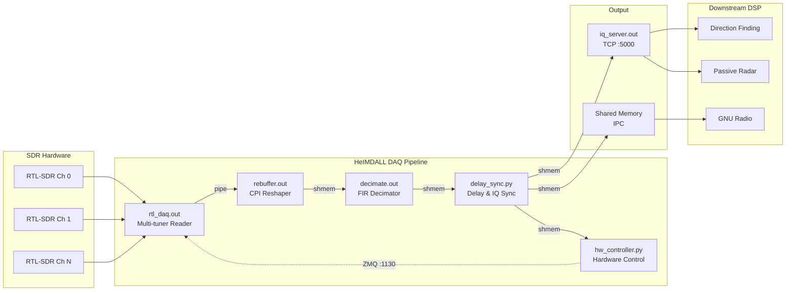

# HeIMDALL DAQ Firmware

<!-- Adjust OWNER/REPO once the GitHub remote is final -->
[](https://github.com/krakenrf/heimdall_daq_fw/actions/workflows/ci.yml)

Coherent data acquisition and signal processing chain for KrakenSDR multichannel
RTL-SDR receivers. Designed for Raspberry Pi 4 (ARM64) and x86_64 Linux systems.

HeIMDALL captures raw IQ samples from multiple synchronized RTL-SDR tuners,
performs sample-level and IQ-level calibration across all channels, and delivers
a coherent multichannel IQ stream to downstream DSP applications such as
direction finding, passive radar, and GNU Radio.


```mermaid
graph LR
    subgraph SDR Hardware
        RTL1[RTL-SDR Ch 0]
        RTL2[RTL-SDR Ch 1]
        RTL3[RTL-SDR Ch N]
    end

    subgraph HeIMDALL DAQ Pipeline
        RD[rtl_daq.out<br/>Multi-tuner Reader]
        RB[rebuffer.out<br/>CPI Reshaper]
        DEC[decimate.out<br/>FIR Decimator]
        DS[delay_sync.py<br/>Delay & IQ Sync]
        HWC[hw_controller.py<br/>Hardware Control]
    end

    subgraph Output
        IQS[iq_server.out<br/>TCP :5000]
        SHM[Shared Memory<br/>IPC]
    end

    subgraph Downstream DSP
        DOA[Direction Finding]
        PR[Passive Radar]
        GR[GNU Radio]
    end

    RTL1 --> RD
    RTL2 --> RD
    RTL3 --> RD
    RD -->|pipe| RB
    RB -->|shmem| DEC
    DEC -->|shmem| DS
    DS -->|shmem| HWC
    DS -->|shmem| IQS
    DS -->|shmem| SHM
    IQS --> DOA
    IQS --> PR
    SHM --> GR
    HWC -.->|ZMQ :1130| RD
```

## Features

- **Coherent multichannel acquisition** — cross-correlation sample-delay
  estimation, fractional-delay correction via sampling-frequency PPM tuning,
  and IQ amplitude/phase calibration via eigendecomposition, with continuous
  sync tracking and automatic recalibration on drift or frequency change
- **Real-time pipeline** — tiered `SCHED_FIFO` priorities, per-process CPU
  affinity, memory locking, double-buffered shared-memory transport
- **Runtime control** — TCP control interface (port 5001) and the
  `heimdall-ctl` command-line client: tuning, gains, AGC, recalibration,
  scheduling, RF front-end and antenna-orientation control
- **Signal scheduling** — calibration-aware frequency hopping from INI or JSON
  schedules (loop / once / pingpong), per-entry gains and dwell in frames or
  seconds
- **Monitoring** — JSON status endpoint (port 5002), rolling metrics, structured
  event bus with ZMQ PUB fan-out (port 5003), optional syslog
- **Persistence (optional)** — BerkeleyDB-backed frame metrics, calibration
  history, per-frequency scan aggregates, and schedule state with automatic
  rotation
- **Federation (optional)** — multiple DAQ instances with coordinated
  scheduling, health monitoring, coordinator election, and IQ stream
  aggregation
- **RF front-end modelling (optional)** — external LNA gain staging, cascaded
  Friis noise-figure budget, P1dB compression advisories, runtime bias-tee
  switching
- **Antenna orientation (optional)** — rotator/pan-tilt control (GS-232, PWM
  servo, PCA9685 I2C, mock) with autonomous scan-and-peak
- **Pluggable transport and offload layers** — shared memory is the default
  and only enabled backend; SPI, PCIe, USB3, Ethernet transports and FPGA/GPU
  offload engines exist as compile-time-optional, experimental drivers

## Quick Start

On a fresh Debian/Ubuntu/Raspberry Pi OS (64-bit) system:

```bash
git clone https://github.com/krakenrf/heimdall_daq_fw
cd heimdall_daq_fw

# Installs build deps, the krakenrf librtlsdr fork, the FIR DSP library
# (KFR on x86_64/aarch64, Ne10 on armv7l), Python packages, RT limits,
# and builds the C core:
./util/install.sh
```

Then run the chain (from `Firmware/`, requires sudo):

```bash
cd Firmware
sudo ./daq_start_sm.sh          # start with real SDR hardware
sudo ./daq_synthetic_start.sh   # or: simulation mode, no hardware required
sudo ./daq_stop.sh              # stop all DAQ chain processes
```

Configuration lives in `Firmware/daq_chain_config.ini` (presets in
`config_files/`). The start scripts validate the config with
`ini_checker.py` and refuse to start on errors. Check the running chain:

```bash
heimdall-ctl status             # or: python3 -m heimdall_ctl status  (PYTHONPATH=util)
```

Logs: instance 0 writes `Firmware/_logs/*.log`; federation instance N > 0
writes `Firmware/_logs/instN/*.log`. PID files are kept under
`Firmware/_logs/inst<N>/pids/`.

If you just want to run the KrakenSDR direction-finding or passive-radar
software, prefer the premade images and install scripts documented in the
[KrakenSDR Wiki](https://github.com/krakenrf/krakensdr_docs/wiki).

## Building from Source

The C core is built from `Firmware/_daq_core/`:

```bash
cd Firmware/_daq_core
make -j4
```

This produces the four pipeline binaries: `rtl_daq.out`, `rebuffer.out`,
`decimate.out`, `iq_server.out`.

### Make variables

| Variable | Values | Meaning |
|----------|--------|---------|
| `ENGINE` | `auto` (default) \| `kfr` \| `ne10` \| `generic` | FIR/convert engine. `auto` resolves per arch: x86_64 → `kfr`, aarch64/arm64 → `kfr`, 32-bit ARM → `ne10`, anything else → `generic`. `generic` is a dependency-free plain-C engine (no KFR/Ne10 needed). |
| `BUILD` | `release` (default) \| `debug` \| `asan` | `debug` = `-Og -g`; `asan` = `-O1 -g -fsanitize=address,undefined`. |
| `MARCH` | unset (default) \| `portable` \| explicit flags | Unset keeps native tuning (`-march=native` / `-mcpu=native`). `portable` drops all arch-specific flags (CI, distributable binaries). Any other value is passed through, e.g. `MARCH='-mcpu=cortex-a72'`. |

> **Note:** aarch64/arm64 now defaults to the KFR engine. The historic aarch64
> Ne10 branch never linked (`libNE10.a` is armv7-only); Ne10 remains the
> default only on 32-bit ARM.

The `kfr` and `ne10` builds also compile the generic engine, so
`[offload] fir_engine = generic` is selectable at runtime; auto-detection still
picks the platform engine by default.

Other targets: `make all-offload` (all optional transport/offload objects),
`make libs` (shared libraries for Python ctypes), `make pgo-profile` /
`make pgo-optimize` (profile-guided optimization; `make clean` deliberately
keeps the `.gcda` profiles, `make distclean` removes them).

### Copy-in dependencies

External libraries are copied **into** `Firmware/_daq_core/` before building
and resolved via `-I. -L.`:

| Files | Needed for | Source |
|-------|-----------|--------|
| `librtlsdr.a`, `rtl-sdr.h`, `rtl-sdr_export.h` | always (`rtl_daq.out`) | [krakenrf/librtlsdr](https://github.com/krakenrf/librtlsdr) fork — the stock distro librtlsdr does **not** work (missing `rtlsdr_set_dithering` etc.) |
| `libkfr_capi.so*`, `kfr/` headers | `ENGINE=kfr` | [kfrlib/kfr](https://github.com/kfrlib/kfr) (capi build, clang; PIC required on arm64) |
| `libNE10.a` | `ENGINE=ne10` (32-bit ARM only) | [projectNe10/Ne10](https://github.com/projectNe10/Ne10) |

`util/install.sh` performs the whole flow (clone, build, copy-in, `make`) for
x86_64, aarch64, and armv7l. For a manual walk-through of the same steps, see
the script itself — it is the reference procedure. Reproducible dependency-light
builds are available via `ci/build.sh generic|kfr|asan` (used by CI, works
locally; caches under `.ci-deps/`).

System build packages: `build-essential cmake git libusb-1.0-0-dev libzmq3-dev`
(plus `clang` for KFR).

### Python environment

Python 3.8+ with `numpy`, `scipy`, `numba`, `pyzmq`, `scikit-rf`. Optional:
`berkeleydb` (persistent storage). On Raspberry Pi the conda/miniforge
environment `kraken` is the tested setup (see the
[KrakenSDR Wiki](https://github.com/krakenrf/krakensdr_docs/wiki)); on desktop
systems plain `pip` works.

Installing the repo as a package (`pip install .`) installs **only** the
`heimdall-ctl` console script; the DAQ pipeline itself is not a Python package
and runs from the source tree.

## Testing

```bash
cd Firmware

./unit_test.sh --ci      # hardware-free suite (15 modules), no sudo, no SDR,
                         # no C binaries required; runs on Linux and macOS.
                         # Exit 0 = all modules passed. Missing optional deps
                         # (C compiler, berkeleydb, pyzmq, numba) cause SKIPs
                         # with a printed reason, not failures.

sudo ./unit_test.sh --sudo   # pipeline suites (rebuffer/decimator/delay_sync):
                             # Linux + root + built C binaries + the
                             # unit_test_k4 config values. The suites copy the
                             # config to a temp dir; the live file is never
                             # modified.

./unit_test.sh           # legacy behavior: decimator pipeline suite via sudo
```

The full-chain end-to-end test is run separately (real or synthetic chain):
`sudo python3 -W ignore -m unittest -v _testing/unit_test/test_sys.py`.

Individual modules can always be run directly with
`python3 -m unittest -v _testing/unit_test/<module>.py`.

### Continuous integration

`.github/workflows/ci.yml` runs on every push/PR:

- **c-build** — `ci/build.sh` on `ubuntu-latest` and `ubuntu-24.04-arm`, in
  both the `generic` (dependency-light, fast) and `kfr` (full engine, cached)
  lanes
- **asan** — the core compiled with `-fsanitize=address,undefined`
- **python** — `ini_checker.py no_hw`, `./unit_test.sh --ci`, and a
  `pip install .` + `heimdall-ctl --help` smoke test on Ubuntu and macOS

There is intentionally no FPGA gateware job: `_fpga_gateware` lint/verify do
not currently pass in a clean environment (see the note in `ci.yml`).

## Configuration

All configuration is in `Firmware/daq_chain_config.ini`
(`ini_version = 8`). Key sections:

| Section | Key Parameters |
|---------|----------------|
| `[hw]` | `num_ch` (channels), `en_bias_tee` |
| `[daq]` | `center_freq`, `sample_rate`, `gain`, `en_noise_source_ctr`, optional `listen_address` (bind address for the IQ/control/status/event servers; default `0.0.0.0`) |
| `[pre_processing]` | `cpi_size`, `decimation_ratio`, `fir_tap_size`, `fir_window` |
| `[calibration]` | `cal_track_mode`, `corr_size`, `en_iq_cal`, tolerances |
| `[data_interface]` | `out_data_iface_type` (shmem/eth) |
| `[schedule]` | `en_schedule`, `frequencies`, `dwell_frames` or `dwell_time_sec`, `repeat_mode` |
| `[database]` | `en_db`, `db_dir`, `rotation_max_age_hours`, `write_batch_size` |
| `[monitoring]` | `en_monitoring`, `en_syslog`, `en_metrics`, `en_status_server`, `en_zmq_pub`, optional `drop_window_sec` (health window, default 60 s) |
| `[offload]` | `rebuffer_transport`, `decimator_transport`, `fir_engine` (`auto`/`kfr`/`neon`/`generic`/`fpga`/`gpu`), `fft_engine` |
| `[federation]` | `instance_id`, `port_stride`, `en_federation`, `coordinator_host`/`coordinator_port`, `peer_list` (canonical form `host:instance_id`) |
| `[amplification]` | `en_amplification`, `ext_lna_gains_db`, `ext_lna_nf_db`, `ext_lna_p1db_dbm`, `en_bias_tee_runtime` |
| `[antenna]` | `en_antenna_profile`, `element_gain_dbi`, `beamwidth_az_deg`, `polarization`, `cable_loss_db`, `boresight_az_offset_deg` |
| `[orientation]` | `en_orientation`, `backend` (`mock`/`gs232`/`pwm_servo`/`i2c_pantilt`), `bearing_mode`, `min_sync_state`, `en_scan` |
| `[fpga]` `[gpu]` `[pcie]` `[usb3]` `[dma]` `[hat_uart]` `[hat_i2c]` | experimental transport/offload hardware |

All optional sections (`[schedule]`, `[database]`, `[monitoring]`,
`[offload]`, `[federation]`, `[amplification]`, `[antenna]`, `[orientation]`,
`[fpga]`, `[gpu]`, `[pcie]`, `[usb3]`, `[dma]`, `[hat_uart]`, `[hat_i2c]`)
are **disabled by default**; with them absent or disabled the chain behaves
exactly like the classic firmware.

Presets in `config_files/`: `kraken_default` (5-ch KrakenSDR),
`kerberos_default` (KerberosSDR), `kraken_development`, `unit_test_k4`
(pipeline tests), `directional_df` (worked amplified-receiver + rotator
preset), and `performance/` (minimal / balanced / maximum tuning profiles).

`util/cfg_gen.py` generates a config from signal parameters;
`Firmware/ini_checker.py [config_path] [no_hw]` validates one (exit code
0/1, `no_hw` skips hardware probes).

## Runtime Control — heimdall-ctl

`heimdall-ctl` is the command-line client for a running chain. Install it with
`pip install .` (console script), or run it in-tree via `util/bin/heimdall-ctl`
or `PYTHONPATH=util python3 -m heimdall_ctl`.

| Subcommand | Action |
|------------|--------|
| `status [--watch]` | Pipeline status (sync state, frequency, health, drops) |
| `tune <freq_hz>` | Set RF center frequency |
| `gain ...` | Set tuner IF gains |
| `agc` | Enable automatic gain control |
| `recal` | Force recalibration (sends `INIT`) |
| `metrics` | Rolling performance statistics |
| `events [--tail]` | Recent events (ring buffer, or live via ZMQ :5003) |
| `cal-history [freq]` | Calibration history from the DB |
| `freq-scan [freq]` | Per-frequency scan summary from the DB |
| `schedule load\|stop\|query\|next [file]` | Manage the signal schedule |
| `lna-gain ...` | Set external LNA gains (dB; the tenths-dB wire encoding is handled by the CLI) |
| `bias-tee ...` | Per-channel inline-LNA bias-tee power |
| `bearing <az> [el]` | Slew the antenna to a bearing |
| `park` | Park the antenna at its configured bearing |
| `scan start\|stop` | Autonomous scan-and-peak control |
| `orientation` | Query rotator/orientation state |
| `rf-budget` | Query the RF link budget (total gain, NF, compression) |
| `config-show` | Display the resolved configuration |

Global flags: `--host`, `--port-ctl`, `--port-status`, `--port-events`,
`--config`, `--instance N` (applies the federation port offset), `--json`,
`--timeout`.

```bash
heimdall-ctl tune 433000000
heimdall-ctl bearing 137.5 12
heimdall-ctl scan start
heimdall-ctl rf-budget --json
```

A scripted client example for the RF front-end / orientation commands is at
`util/orientation_scan_example.py`.

## Network Interfaces

Every port follows `effective_port = base_port + instance_id * port_stride`
(default stride 100); instance 0 uses the bases below. Bind address is
`[daq] listen_address` (default `0.0.0.0`).

| Port | Protocol | Purpose |
|------|----------|---------|
| 5000 | TCP | IQ frame streaming — client sends `streaming`, server sends `[1024-byte header][payload]` per frame, client acks each with `IQDownload` |
| 5001 | TCP | Control — exactly 128-byte frames: 4-byte ASCII verb + 124-byte payload. Verbs: `FREQ` `GAIN` `AGC ` `INIT` `SCHD` `SCHS` `SCHQ` `SCHN` `EGAN` `BIAS` `RFQ ` `ORNT` `PARK` `SCAN` `OSTP` `OQRY`. Replies are 128 bytes starting `FNSD`; the query verbs (`RFQ `, `OQRY`, `SCHQ`) return `FNSD` + NUL-padded UTF-8 JSON and are answered in any pipeline state |
| 5002 | TCP | Status — newline-terminated text commands `PING` `STATUS` `METRICS` `EVENTS` `EVENTS_DROPPED` `DB_STATS` `SCAN_SUMMARY [freq]` `CAL_HISTORY [freq]`, each answered with one JSON object + `\n` |
| 5003 | ZMQ PUB | Event stream, topic = event type |
| 1130 | ZMQ REQ/REP | Internal tuner control (128-byte messages, command chars `r c g a s n b h`) |
| 6000 | TCP | Federation coordinator |
| 7000 | TCP | Federation IQ router (aggregated stream) |

## Monitoring & Observability

- **Status server** (`daq_status_server.py`, port 5002) — pipeline state,
  counters, and windowed health: `ok` when `sync_state >= 5` with zero frame
  drops inside the rolling window (`[monitoring] drop_window_sec`, default
  60 s); `degraded` when `sync_state >= 2`; `error` otherwise. `STATUS`
  replies include `instance_id`, `recent_drops`, and `drop_window_sec`.
- **Metrics** (`daq_metrics.py`) — O(1) recording into circular numpy buffers;
  `METRICS` returns min/max/avg/p95 per metric (frame latency, throughput,
  drop-rate deltas).
- **Event bus** (`daq_events.py`) — non-blocking dispatch to Python logging,
  syslog, a ring buffer, and ZMQ PUB (:5003); ~24 event types covering sync,
  calibration, gain/frequency changes, scheduling, DB, and federation peers.
- **Persistence** (`daq_db.py`, optional `berkeleydb`) — frame metrics,
  calibration history, per-frequency scan aggregates, hardware snapshots, and
  schedule state, written from a background thread with automatic age-based
  rotation. On-disk format is **schema generation 2** (big-endian keys,
  versioned records); a generation-1 database directory is discarded and
  recreated on first read-write open. `heimdall-ctl cal-history` /
  `freq-scan` and the port-5002 `DB_STATS` / `SCAN_SUMMARY` / `CAL_HISTORY`
  commands read it live.

Frame-level telemetry also travels in-band: the 1024-byte IQ header
(version 8) carries named slots in its reserved region for external LNA gains,
total system gain, system noise figure, compression flags, bias-tee state,
antenna bearing, rotator state, aggregate channel power, and a cumulative USB
ring-buffer overrun counter (slot 102). Consumers that ignore the reserved
region parse v8 frames unchanged.

## Federation (Multi-Instance)

Multiple DAQ instances — on one host or many — can operate as a federation:

- `federation_coordinator.py` (port 6000) fans out FREQ/GAIN/STATUS/REBALANCE
  to all instances (`python3 _daq_core/federation_coordinator.py --port 6000
  --instances "hostA:0,hostB:1"`)
- `federation_scheduler.py` partitions a master frequency schedule across
  healthy instances (`round_robin` or `range`)
- `federation_health.py` polls peer status servers, emits
  `peer_up`/`peer_down`/`peer_degraded` events, and elects the lowest healthy
  `instance_id` as coordinator
- `federation_iq_router.py` aggregates all IQ streams onto port 7000, tagging
  frames with the source `unit_id`

Instance 0 uses unprefixed FIFO/shared-memory names and base ports (fully
backward compatible); instance N prefixes `instN_` and offsets every port by
`N * port_stride`. `peer_list` entries are canonically `host:instance_id`
(legacy `host:port` entries still parse).

## RF Front-End & Antenna Orientation

Three optional subsystems, all disabled by default and all running inside
`hw_controller.py` (no extra processes):

- **`[amplification]`** — models external LNAs ahead of the tuner: per-channel
  continuous-dB gain (`EGAN`), cascaded Friis noise figure, P1dB compression
  headroom (advisory only — never auto-changes gains), and runtime bias-tee
  switching (`BIAS`; GPIO 0 stays reserved for the noise source, and bias
  changes defer during calibration bursts)
- **`[antenna]`** — antenna profile (element gain dBi, beamwidth, polarization,
  cable loss, boresight offset) feeding both the link budget and the pointing
  logic
- **`[orientation]`** — rotator/pan-tilt state machine with GS-232 serial,
  PWM-servo, PCA9685 I2C, and mock backends (the factory falls back to mock so
  the chain always starts). Bearing sources: external `ORNT`, a configured
  fixed/park bearing, or autonomous scan-and-peak (`SCAN`) maximizing the
  aggregate channel power stamped in the IQ header. Motion is gated on sync
  state and the noise source, so the array never slews mid-calibration.

See `config_files/directional_df/` for a complete worked preset and
`heimdall-ctl lna-gain / bias-tee / bearing / scan / rf-budget / orientation`
for runtime control.

## Architecture Notes

- **Processes** — `rtl_daq.out` (USB reader, RT prio 99) → `rebuffer.out`
  (CPI reshaper, 94) → `decimate.out` (FIR decimator, 92) → `delay_sync.py`
  (calibration/sync, 90) → `iq_server.out` (TCP output, 88), with
  `hw_controller.py` (82) as the control plane. Priorities and CPU affinity
  are set by `daq_start_sm.sh`.
- **IPC** — double-buffered POSIX shared memory (`<name>_A`/`<name>_B`) with
  single-byte FIFO signaling (`A_BUFF_READY=1`, `B_BUFF_READY=2`,
  `INIT_READY=10`, `TERMINATE=255`) over forward/backward FIFOs in
  `_data_control/`; drop mode uses `O_NONBLOCK`.
- **IQ header** — 1024-byte binary header on every frame (sync word
  `0x2bf7b95a`, version 8), defined in lockstep in `iq_header.h` and
  `iq_header.py`; the ABI is enforced by a C-vs-Python cross-check test.
- **Transport abstraction** — `transport.h/c` vtable with `transport_create()`
  factory; the default `TRANSPORT_SHM` backend wraps the legacy shared-memory
  code and is behavior-identical to it. SPI/PCIe/USB3/Ethernet drivers are
  compile-time optional (`HAS_*_TRANSPORT`) and off by default.
- **Offload abstraction** — `offload.h/c` FIR/convert engine vtable with
  auto-detection: KFR (x86_64, aarch64), Ne10/NEON (32-bit ARM), generic
  plain-C (any platform), plus experimental FPGA (`_fpga_gateware/`,
  Yosys/nextpnr, ECP5/iCE40) and GPU (VideoCore VI) engines.
- **Startup** — `daq_start_sm.sh` validates the config, regenerates FIR
  coefficients (`fir_filter_designer.py` → `_data_control/fir_coeffs.txt`),
  runs hardware discovery (`hw_discover.py` → `_data_control/hw_caps.json`),
  creates FIFOs, then launches the pipeline with RT priorities.

For subsystem depth see [`Documentation/`](Documentation/README.md):
[architecture.md](Documentation/architecture.md) (pipeline, IPC, state
machines), [protocols.md](Documentation/protocols.md) (every port and wire
format, full IQ header v8 layout),
[configuration.md](Documentation/configuration.md) (key-by-key INI
reference), [developer_guide.md](Documentation/developer_guide.md) (build,
test, CI, invariants), and
[tutorial_directional_df.md](Documentation/tutorial_directional_df.md)
(worked directional-DF walkthrough).

## Deployment

`packaging/` contains:

- `systemd/heimdall-daq.service` — single-instance unit wrapping
  `daq_start_sm.sh`/`daq_stop.sh` with the required `LimitRTPRIO`/
  `LimitMEMLOCK` grants
- `systemd/heimdall-daq@.service` — per-federation-instance template
- `logrotate/heimdall` — rotation for `_logs/*.log` and `_logs/inst*/*.log`

See `packaging/systemd/README.md` for the install procedure.

## Project Structure

```
heimdall_daq_fw/
├── Firmware/
│   ├── _daq_core/                    # Pipeline core (C + Python)
│   │   ├── Makefile                  # ENGINE/BUILD/MARCH build system
│   │   ├── rtl_daq.c/h               # Multi-tuner SDR reader
│   │   ├── rebuffer.c                # CPI block reshaper
│   │   ├── fir_decimate.c            # FIR filter + decimation
│   │   ├── iq_server.c               # TCP IQ server (:5000)
│   │   ├── iq_header.h/c/py          # 1024-byte IQ frame header (lockstep C+Python)
│   │   ├── sh_mem_util.c/h           # Shared memory + FIFO signaling
│   │   ├── delay_sync.py             # Delay & IQ synchronizer, status/metrics/DB hooks
│   │   ├── hw_controller.py          # Control plane: tuner, scheduler, RF front-end, orientation
│   │   ├── shmemIface.py             # Python shared-memory interface
│   │   ├── transport*.c/h, transportIface.py   # Pluggable transport layer (shm default)
│   │   ├── offload*.c/h              # FIR/convert engines: kfr, neon, generic, fpga, gpu
│   │   ├── offload_engines.py, offload_gpu.py  # Python FFT/correlation engines
│   │   ├── signal_scheduler.py       # Calibration-aware frequency scheduler
│   │   ├── gain_budget.py            # Link budget (gain/NF/P1dB)
│   │   ├── antenna_profile.py        # Antenna characterization
│   │   ├── orientation_controller.py # Orientation state machine + scan-and-peak
│   │   ├── rotator_controller.py     # Rotator backends (mock/gs232/pwm_servo/i2c_pantilt)
│   │   ├── daq_db.py, daq_db_records.py        # BerkeleyDB persistence (schema gen 2)
│   │   ├── daq_status_server.py      # JSON status endpoint (:5002)
│   │   ├── daq_metrics.py, daq_events.py       # Metrics + event bus (:5003)
│   │   ├── federation_*.py           # Coordinator, scheduler, health, IQ router
│   │   ├── hw_discover.py, auto_config.py      # Capability discovery + auto config
│   │   └── inter_module_messages.py  # ZMQ tuner-control messages (:1130)
│   ├── _fpga_gateware/               # Experimental FPGA gateware (ECP5/iCE40, Yosys+nextpnr)
│   ├── _testing/                     # Test suites, generators, synthesizer, analyzers
│   ├── _data_control/                # Runtime FIFOs + relay/control files
│   ├── _logs/                        # Runtime logs (instN/ per federation instance)
│   ├── daq_chain_config.ini          # Main configuration (ini_version 8)
│   ├── daq_start_sm.sh               # Start with real hardware
│   ├── daq_synthetic_start.sh        # Start in simulation mode
│   ├── daq_stop.sh                   # Stop (PID-file based; --legacy for old binaries)
│   ├── unit_test.sh                  # Test runner (--ci / --sudo lanes)
│   ├── ini_checker.py                # Config validator (exit-code contract)
│   └── fir_filter_designer.py        # FIR coefficient generator (auto-run at start)
├── config_files/
│   ├── kraken_default/               # 5-channel KrakenSDR preset
│   ├── kerberos_default/             # KerberosSDR preset
│   ├── kraken_development/           # Development preset
│   ├── unit_test_k4/                 # Pipeline-test configuration
│   ├── directional_df/               # Amplified receivers + rotator preset
│   └── performance/                  # minimal / balanced / maximum profiles
├── util/
│   ├── install.sh                    # Full dependency + build installer
│   ├── heimdall_ctl/                 # heimdall-ctl CLI package (pip-installable)
│   ├── bin/heimdall-ctl              # In-tree launcher
│   ├── cfg_gen.py                    # Config generator
│   ├── orientation_scan_example.py   # RF front-end / orientation client example
│   ├── system_tuning.py              # RT system optimization
│   └── performance_monitor.py        # Per-process performance tracking
├── ci/build.sh                       # Reproducible C build lanes (generic/kfr/asan)
├── .github/workflows/ci.yml          # CI: C matrix + asan + Python (ubuntu/macos)
├── packaging/                        # systemd units + logrotate policy
├── Documentation/                    # In-depth documentation
├── pyproject.toml                    # heimdall-ctl packaging + pytest config
├── CONTRIBUTING.md                   # Contributor guide
└── CHANGELOG.md                      # Release notes
```

## License

GNU General Public License v3.0 — see `LICENSE`.

Authors: Tamas Peto, Carl Laufer
